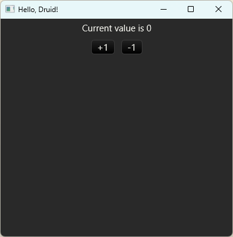

# Rust Examples [⬆](../README.md#top)

<table style="font-family:Helvetica,Arial;line-height:1.6;">
  <tr>
  <td style="border:0;padding:0 10px 0 0;min-width:120px;"></td>
  <td style="border:0;padding:0;vertical-align:text-top;">This repository gathers <a href="https://www.rust-lang.org/" rel="external">Rust</a> code examples from various websites. 
  It also includes several build scripts (<a href="https://en.wikibooks.org/wiki/Windows_Batch_Scripting">batch files</a>, <a href="https://doc.rust-lang.org/cargo/reference/manifest.html">Cargo files</a>) for experimenting with <a href="https://www.rust-lang.org/" rel="external">Rust</a> on a Windows machine.
  </td>
  </tr>
</table>

### `diceroller` Example

Example [`diceroller`](./diceroller/) is presented by Nicolas Fränkel in his blog post ["diceroller, a sample Rust project"](https://blog.frankel.ch/start-rust/8/) (July 2021). The project has the following directory structure :
<pre style="font-size:80%;margin-top:-16px;">
<b>diceroller&gt; <a href="https://learn.microsoft.com/en-us/windows-server/administration/windows-commands/tree" rel="external">tree</a> /a /f . | <a href="https://learn.microsoft.com/en-us/windows-server/administration/windows-commands/findstr" rel="external">findstr</a> /v /b [A-Z]</b>
|   <a href="./diceroller/00download.txt">00download.txt</a>
|   <a href="./diceroller/Cargo.toml">Cargo.toml</a>
\---<b>src</b>
    |   <a href="./diceroller/src/main.rs">main.rs</a>
    \---<b>droller</b>
            <a href="./diceroller/src/droller/damage.rs">damage.rs</a>
            <a href="./diceroller/src/droller/dice.rs">dice.rs</a>
            <a href="./diceroller/src/droller/mod.rs">mod.rs</a>
</pre>

We get the following output when executing the [`cargo`][cargo_cli] command :
<pre style="font-size:80%; margin-top:-16px;">
<b>diceroller&gt; <a href="https://doc.rust-lang.org/cargo/commands/cargo-run.html" rel="external">cargo</a> -q run</b>
normal damage: stun: 2, body: 1
killing damage: stun: 8, body: 4 (mult: 2)
killing damage (half): stun: 1, body: 1 (mult: 1)
killing damage (pip): stun: 5, body: 1 (mult: 5)
</pre>

<!--=======================================================================-->

### `factorials` Example [**&#x25B4;**](#top)

Example [`factorials`](./factorials/) is presented by Oopscene in his blog post ["C++ vs.Rust: Factorial"](https://oopscenities.net/2023/02/22/factorial-in-rust-vs-factorial-in-c/) (February 2023). The project is organized as follows :
<pre style="font-size:80%;margin-top:-16px;">
<b>factorials&gt; <a href="https://learn.microsoft.com/en-us/windows-server/administration/windows-commands/tree">tree</a> /a /f . | <a href="https://learn.microsoft.com/en-us/windows-server/administration/windows-commands/findstr">findstr</a> /v /b [A-Z]</b>
|   <a href="./factorials/00download.txt">00download.txt</a>
|   <a href="./factorials/build.bat">build.bat</a>
|   <a href="./factorials/Cargo.toml">Cargo.toml</a>
\---<b>src</b>
    \---<b>main</b>
        \---<b>rust</b>
                <a href="./factorials/src/main/rust/main.rs">main.rs</a>
</pre>

We get the following output when executing the [`cargo`][cargo_cli] command :
<pre style="font-size:80%;margin-top:16px;">
<b>factorials&gt; <a href="https://doc.rust-lang.org/cargo/commands/cargo-run.html" rel="external">cargo</a> run</b>
   Compiling factorials v0.1.0 (K:\examples\factorials)
    Finished dev [unoptimized + debuginfo] target(s) in 0.38s
     Running `target\debug\main.exe`
factorial(10) = 3628800
non_recursive_factorial(10) = 3628800
factorial_with_for(10) = 3628800
</pre>

And with command [`build.bat`](./factorials/build.bat) we get the following output :
<pre style="font-size:80%;margin-top:16px;">
<b>factorials&gt; <a href="./factorials/build.bat">build</a> -verbose run</b>
Compile 1 Rust source file to directory "target"
factorial(10) = 3628800
non_recursive_factorial(10) = 3628800
factorial_with_for(10) = 3628800
</pre>

<!--=======================================================================-->

### `rust-ui-druid` Example [**&#x25B4;**](#top)

Example [`rust-ui-druid`](./rust-ui-druid/) illustrates the usage of [Druid], a data-oriented Rust UI design toolkit. The project is organized as follows :
<pre style="font-size:80%;margin-top:-16px;">
<b>rust-ui-druid&gt; <a href="https://learn.microsoft.com/en-us/windows-server/administration/windows-commands/tree">tree</a> /a /f . | <a href="https://learn.microsoft.com/en-us/windows-server/administration/windows-commands/findstr">findstr</a> /v /b [A-Z]</b>
|   <a href="./rust-ui-druid/00download.txt">00download.txt</a>
|   <a href="./rust-ui-druid/Cargo.toml">Cargo.toml</a>
\---<b>src</b>
        <a href="./rust-ui-druid/src/main.rs">main.rs</a>
</pre>

We get the following output when executing the [`cargo`][cargo_cli] command :
<pre style="font-size:80%;margin-top:-16px;">
<b>rust-ui-druid&gt; <a href="https://doc.rust-lang.org/cargo/commands/cargo-run.html" rel="external">cargo</a> -q run</b>
</pre>

***

*[mics](https://lampwww.epfl.ch/~michelou/)/July 2024* [**&#9650;**](#top)
&nbsp;

<!-- link refs -->

[cargo_cli]: https://doc.rust-lang.org/cargo/commands/cargo.html
[druid]: https://crates.io/crates/druid
